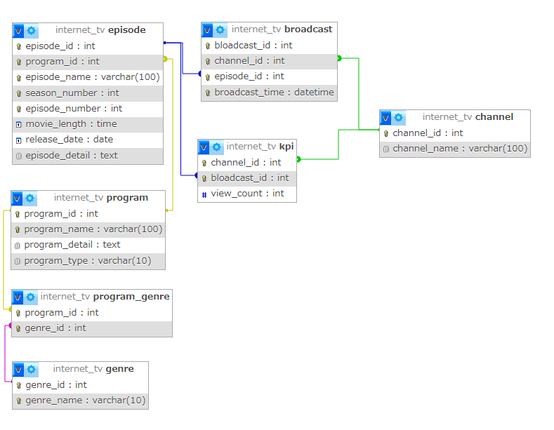

# データベース設計
仕様
- ドラマ1、ドラマ2、アニメ1、アニメ2、スポーツ、ペットなど、複数のチャンネルがある
- 各チャンネルの下では時間帯ごとに番組枠が1つ設定されており、番組が放映される
- 番組はシリーズになっているものと単発ものがある。シリーズになっているものはシーズンが1つものと、シーズン1、シーズン2のように複数シーズンのものがある。各シーズンの下では各エピソードが設定されている
- 再放送もあるため、ある番組が複数チャンネルの異なる番組枠で放映されることはある
- 番組の情報として、タイトル、番組詳細、ジャンルが画面上に表示される
- 各エピソードの情報として、シーズン数、エピソード数、タイトル、エピソード詳細、動画時間、公開日、視聴数が画面上に表示される。単発のエピソードの場合はシーズン数、エピソード数は表示されない
- ジャンルとしてアニメ、映画、ドラマ、ニュースなどがある。各番組は1つ以上のジャンルに属する
- KPIとして、チャンネルの番組枠のエピソードごとに視聴数を記録する。なお、一つのエピソードは複数の異なるチャンネル及び番組枠で放送されることがあるので、属するチャンネルの番組枠ごとに視聴数がどうだったかも追えるようにする

## テーブル設計
概要
| 項目   | 説明                        |
|--------|-----------------------------|
| 物理名 | データベース上の名称        |
| 論理名 | 人が識別しやすい名称        |

| No | 物理名       | 論理名            | 用途                                    |
|----|--------------|-------------------|-----------------------------------------|
| 1  | channel      | チャンネルテーブル | チャンネルの情報を保存                  |
| 2  | program      | 番組テーブル       | 番組名、詳細、タイプを保存              |
| 3  | episode      | エピソードテーブル | 各話名、シーズン、番組時間等を保存      |
| 4  | genre        | ジャンルテーブル   | ジャンルの情報を保存                    |
| 5  | program_genre| 番組ジャンルテーブル | 番組がどのジャンルに該当するかを保存    |
| 6  | broadcast    | 放送枠テーブル     | チャンネルや放送開始時間等を保存        |


## 各テーブル詳細
1:チャンネルテーブル
| カラム名       | データ型     | NULL | キー    | 初期値 | AUTO INCREMENT | 説明         |
|----------------|--------------|------|---------|--------|----------------|--------------|
| channel_id     | INT          | NO   | PK      |        | YES            | チャンネルID |
| channel_name   | VARCHAR(100) | NO   | UNIQUE  |        | NO             | チャンネル名 |

**ユニークキー制約**: `channel_name` カラムに対して設定


2:番組テーブル
| カラム名       | データ型     | NULL | キー    | 初期値 | AUTO INCREMENT | 説明               |
|----------------|--------------|------|---------|--------|----------------|--------------------|
| program_id     | INT          | NO   | PK      |        | YES            | 番組ID             |
| program_name   | VARCHAR(100) | NO   | UNIQUE  |        | NO             | 番組名             |
| program_detail | TEXT         | NO   |         |        | NO             | 番組詳細           |
| program_type   | VARCHAR(10)  | NO   |         |        | NO             | 単発 or シリーズ   |

**ユニークキー制約**: `program_name` カラムに対して設定


3:エピソードテーブル
| カラム名         | データ型     | NULL | キー    | 初期値 | AUTO INCREMENT | 説明           |
|------------------|--------------|------|---------|--------|----------------|----------------|
| episode_id       | INT          | NO   | PK      |        | YES            | エピソードID   |
| program_id       | INT          | NO   | FK      |        | NO             | 番組ID         |
| episode_name     | VARCHAR(100) | NO   |         |        | NO             | エピソード名   |
| season_number    | INT          | YES  |         |        | NO             | シーズン数     |
| episode_number   | INT          | YES  |         |        | NO             | エピソード数   |
| movie_length     | TIME         | NO   |         |        | NO             | 動画時間       |
| release_date     | DATE         | NO   |         |        | NO             | 公開日         |
| episode_detail   | TEXT         | NO   |         |        | NO             | エピソード詳細 |

**外部キー制約**: `program_id` に対して `program` テーブルから設定  
**ユニークキー制約**: `program_id`、`episode_name`、`season_number`、`episode_number` の組み合わせに対して設定


4:ジャンルテーブル
| カラム名   | データ型     | NULL | キー    | 初期値 | AUTO INCREMENT | 説明       |
|------------|--------------|------|---------|--------|----------------|------------|
| genre_id   | INT          | NO   | PK      |        | YES            | ジャンルID |
| genre_name | VARCHAR(100) | NO   | UNIQUE  |        | NO             | ジャンル名 |

**ユニークキー制約**: `genre_name` カラムに対して設定


5:番組ジャンルテーブル
| カラム名    | データ型 | NULL | キー | 初期値 | AUTO INCREMENT | 説明       |
|-------------|----------|------|------|--------|----------------|------------|
| genre_id    | INT      | NO   | FK   |        | NO             | ジャンルID |
| program_id  | INT      | NO   | FK   |        | NO             | 番組ID     |

**外部キー制約**: `genre_id` に対して `genre` テーブルから設定  
**外部キー制約**: `program_id` に対して `program` テーブルから設定  
**ユニークキー制約**: `genre_id`、`program_id` の組み合わせに対して設定


6:放送枠テーブル
| カラム名           | データ型    | NULL | キー    | 初期値 | AUTO INCREMENT | 説明           |
|--------------------|-------------|------|---------|--------|----------------|----------------|
| broadcast_id       | INT         | NO   | PK      |        | YES            | 放送枠ID       |
| channel_id         | INT         | NO   | FK      |        | NO             | チャンネルID   |
| episode_id         | INT         | NO   | FK      |        | NO             | エピソードID   |
| broadcast_time     | DATETIME    | NO   |         |        | NO             | 放送開始時間   |
| broadcast_end_time | DATETIME    | NO   |         |        | NO             | 放送終了時間   |
| view_count         | INT         | NO   |         |        | NO             | 視聴数         |

**外部キー制約**: `channel_id` に対して `channel` テーブルから設定  
**外部キー制約**: `episode_id` に対して `episode` テーブルから設定

## ER図



以上時点で第三正規化まで完了、重複データの入力を防ぐユニークキー制約の設定完了
## データ挿入
```sql
INSERT INTO テーブル名(カラム名,カラム名2) VALUE(値,値2);
```
## データの修正
```sql
UPDATE テーブル名
SET カラム名1=値1, カラム名2=値2, ...
WHERE 条件;
```
## データの削除
```sql
DELETE テーブル名
WHERE カラム名=値;
```

## データ抽出
1,2 視聴数の多い番組の抽出
```sql
SELECT 
    program.program_name,
    episode.season_number,
    episode.episode_number,
    episode.episode_name,
    broadcast.view_count
FROM 
    broadcast
JOIN 
    episode ON broadcast.episode_id = episode.episode_id
JOIN 
    program ON episode.program_id = program.program_id
ORDER BY 
    broadcast.view_count DESC
LIMIT 3;
```
3 本日の番組表
```sql
SELECT 
    channel.channel_name,
    broadcast.broadcast_time,
    broadcast.broadcast_end_time,
    episode.season_number,
    episode.episode_number,
    episode.episode_name,
    episode.episode_detail
FROM 
    broadcast
JOIN 
    episode ON broadcast.episode_id = episode.episode_id
JOIN 
    program ON episode.program_id = program.program_id
JOIN 
    channel ON broadcast.channel_id = channel.channel_id
WHERE 
    DATE(broadcast.broadcast_time) = CURDATE()
ORDER BY 
    broadcast.broadcast_time;
```
4 チャンネルごとの一週間分の番組表
```sql
SELECT 
    broadcast.broadcast_time,
    broadcast.broadcast_end_time,
    episode.season_number,
    episode.episode_number,
    episode.episode_name,
    episode.episode_detail
FROM 
    broadcast
JOIN 
    episode ON broadcast.episode_id = episode.episode_id
JOIN 
    program ON episode.program_id = program.program_id
JOIN 
    channel ON broadcast.channel_id = channel.channel_id
WHERE 
    broadcast.channel_id = <チャンネルID>
    AND DATE(broadcast.broadcast_time) BETWEEN CURDATE() AND DATE_ADD(CURDATE(), INTERVAL 7 DAY)
ORDER BY 
    broadcast.broadcast_time;
```
